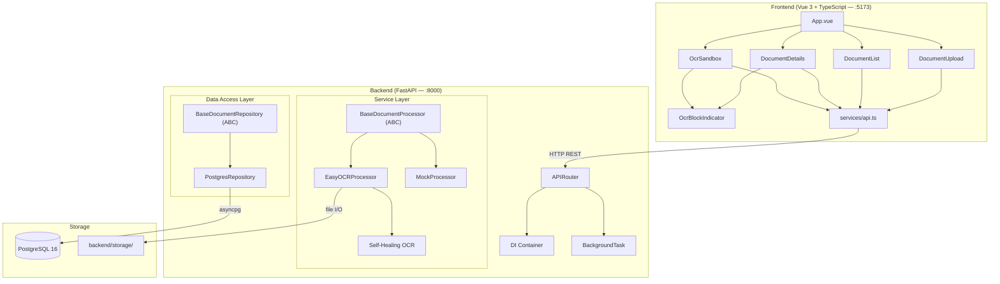
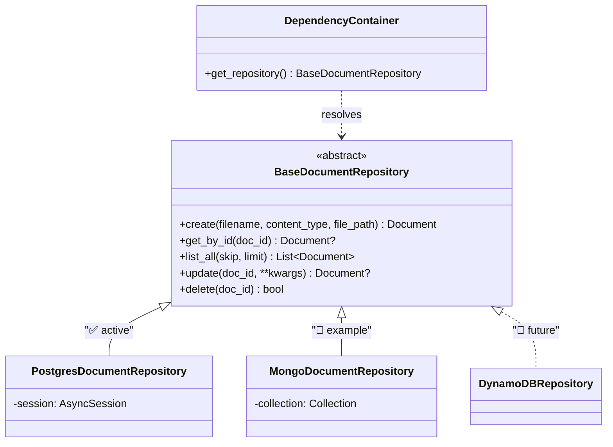
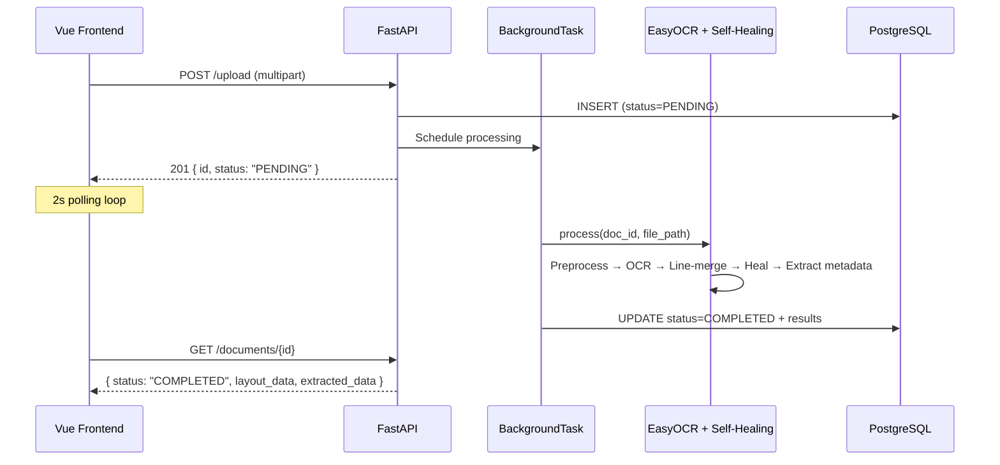
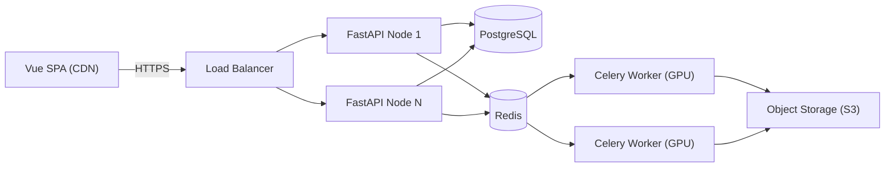

# ETPF (Extendable Tax Processing Framework)

ETPF is a local-first application that processes receipts and PDFs via OCR, extracts structured tax data, and stores it in a document-oriented PostgreSQL schema. Built with Vue 3 + FastAPI + EasyOCR.

---

## Architecture



**4-layer architecture** with abstract interfaces at each boundary:

| Layer | Technology | Abstraction | Status |
|---|---|---|---|
| Presentation | Vue 3 SPA (Vite `:5173`) | `services/api.ts` | ✅ |
| API | FastAPI APIRouter + Pydantic (`:8000/api/v1`) | `DocumentResponse` schema | ✅ |
| Service | EasyOCR + Self-Healing Optimizer | `BaseDocumentProcessor` (ABC) | ✅ |
| Data Access | SQLAlchemy 2.0 async + asyncpg | `BaseDocumentRepository` (ABC) | ✅ |
| Storage | PostgreSQL 16 + local filesystem | Docker + `backend/storage/` | ✅ |

### Repository Adapter Pattern (Database Swap)

The data access layer uses a **repository pattern** — an ABC defines the CRUD contract, concrete implementations handle the driver. ✅ The ABC and PostgreSQL adapter are implemented; alternative adapters show how the pattern enables database swaps:



**Swapping the DB** requires two steps — no router, service, or schema changes:

1. Implement the 5 abstract methods against the new driver (e.g., Motor for MongoDB)
2. Change one return in the DI container:

```diff
 # api/dependencies.py
 def get_repository(session = Depends(get_db)) -> BaseDocumentRepository:
-    return PostgresDocumentRepository(session)
+    return MongoDocumentRepository(mongo_db)
```

Key design decisions in the Postgres adapter: session-per-request via constructor injection, `expire_on_commit=False` for async safety, and **automatic SQLite fallback** if PostgreSQL is unreachable on startup.

### Processor Adapter Pattern (OCR Engine Swap)

Same approach for OCR engines — `BaseDocumentProcessor` ABC with a single `async process()` method returning `{ raw_text, layout_data, extracted_data }`:

| Processor | Purpose | PDF | Self-Healing | Status |
|---|---|---|---|---|
| `EasyOCRDocumentProcessor` | Production OCR (`easyocr.Reader(['de', 'en'])`) | Yes (PyMuPDF dual-mode) | Yes | ✅ |
| `MockDocumentProcessor` | Simulated delay + synthetic bounding boxes | No | No | ✅ |
| `TesseractProcessor` | Alternative open-source OCR engine | — | — | 🔲 |
| `PaddleOCRProcessor` | Multi-language OCR with detection+recognition | — | — | 🔲 |

Swap by changing one line: `return EasyOCRDocumentProcessor()` → `return TesseractProcessor()`.

### Database Schema (`documents` table)

| Column | Type | Notes |
|---|---|---|
| `id` | `UUID` (PK) | Auto-generated UUID-4 |
| `filename` / `content_type` | `VARCHAR` | Original name + MIME type |
| `status` | `VARCHAR(50)` | `PENDING` → `PROCESSING` → `COMPLETED` / `FAILED` |
| `file_path` | `VARCHAR(512)` | Path in `backend/storage/` |
| `raw_text` | `TEXT` | Concatenated OCR output |
| `layout_data` | `JSONB` | `{ width, height, blocks[], optimization_stats }` |
| `extracted_data` | `JSONB` | `{ vendor_name, date, total_amount, tax_amount, line_items[] }` |
| `created_at` / `updated_at` | `TIMESTAMPTZ` | Auto-managed timestamps |

### Request Lifecycle



---

## Directory Structure

```text
ETPF/
├── .github/workflows/main.yml     # CI (backend tests + frontend build)
├── docker-compose.yml             # PostgreSQL 16 container
├── start.ps1 / start.sh           # All-in-one startup scripts
├── backend/
│   ├── app/
│   │   ├── api/                   # Router + FastAPI DI dependencies
│   │   ├── core/config.py         # Settings (CORS, DB, storage path)
│   │   ├── db/                    # BaseDocumentRepository ABC + Postgres impl
│   │   ├── schemas/               # Pydantic response/update models
│   │   └── services/
│   │       ├── base.py            # BaseDocumentProcessor ABC
│   │       ├── easyocr_processor.py   # OCR + line-merge + metadata extraction
│   │       ├── mock_processor.py      # Mock for canvas testing
│   │       ├── self_healing_ocr.py    # Reverse-degradation optimizer
│   │       └── degradations.py        # Stress-test harness (also a CLI)
│   ├── storage/                   # Uploaded files (auto-created)
│   └── run.py
└── frontend/src/
    ├── components/                # Upload, List, Details, Sandbox, HUD overlay
    ├── services/api.ts            # Typed API client + interfaces
    ├── App.vue                    # Dashboard shell + backend health polling
    └── main.ts
```

---

## Setup

**Quick start** — spins up DB + backend + frontend:
```powershell
.\start.ps1          # Windows
./start.sh           # macOS / Linux
```

**Manual:**
```bash
docker compose up -d                          # 1. PostgreSQL on :5432
cd backend && python -m venv .venv && .venv\Scripts\activate
pip install -r requirements.txt && python run.py   # 2. Backend on :8000
cd frontend && npm install && npm run dev          # 3. Frontend on :5173
```

---

## Processing Pipeline

### OCR Engine

Global singleton `easyocr.Reader(['de', 'en'])` with CUDA auto-detection. Offloaded to thread pool via `asyncio.to_thread()`. Tuned: `mag_ratio=1.5`, `contrast_ths=0.1`, `adjust_contrast=0.7`.

### PDF Dual-Mode

- **Digital PDFs** (>15 chars text layer): Extract blocks directly via PyMuPDF `page.get_text("blocks")`, confidence `1.0`.
- **Scanned PDFs**: Render page 1 at `2.0×` zoom → route through image pipeline.

### Image Preprocessing → Line-Merging → Self-Healing

1. **Preprocess**: Grayscale + `2.0×` contrast enhancement.
2. **Line-merge**: Sort blocks by `(ymin, xmin)`, merge consecutive pairs with `>40%` vertical overlap and `<18%` horizontal gap. Union bounding boxes, average confidence.
3. **Self-healing** (blocks with confidence `< 0.70`, max 5 per document):

| Tactic | Filter Stack | Targets |
|---|---|---|
| 1 | `Contrast(2.5×)` → `Sharpness(2.0×)` → `SHARPEN` | Blur, shadows |
| 2 | `LANCZOS 2× upscale` → `Grayscale` → `Binary @130` | Small chars, noise |
| 3 | `Histogram Equalize` → `EDGE_ENHANCE_MORE` | Uneven lighting, folds |

Best-confidence result wins. Early exit at `≥ 0.85`. Healed blocks get `healed: true`, `original_text`, and `confidence_gain` for before/after display.

### Metadata Extraction

| Field | Strategy |
|---|---|
| **Vendor** | First non-numeric block in top 25% of page |
| **Date** | Regex: `DD.MM.YYYY` (German) or `YYYY-MM-DD` (ISO) |
| **Tax ID** | `DE\d{9}` (USt-IdNr) or labeled patterns |
| **Total** | 3-pass: ① keyword+amount in same block, ② nearby keyword block, ③ largest decimal in bottom 60% |
| **Tax** | `total × (0.19 / 1.19)` (19% German MwSt) |

---

## API Endpoints

| Method | Endpoint | Description |
|---|---|---|
| `POST` | `/api/v1/documents/upload` | Upload document (multipart) |
| `GET` | `/api/v1/documents/` | List all documents |
| `GET` | `/api/v1/documents/{id}` | Get document with OCR results |
| `PUT` | `/api/v1/documents/{id}` | Update document fields |
| `DELETE` | `/api/v1/documents/{id}` | Delete document and file |
| `GET` | `/api/v1/documents/{id}/file` | Serve file (`?preview=true` for inline) |
| `POST` | `/api/v1/documents/sandbox/trigger` | Single sandbox OCR test |
| `POST` | `/api/v1/documents/sandbox/stress` | Full degradation stress suite |
| `POST` | `/api/v1/documents/sandbox/stress/step` | Single degradation step |

---

## OCR Sandbox & Stress Testing

Generates synthetic receipt images via PIL, applies parametric degradations, runs through the full pipeline, and scores against ground truth using **substring-window Levenshtein accuracy** (sliding window `±3` chars, `≥55%` match threshold, concatenate matching blocks, average across ground truth lines).

| Degradation | Implementation | Levels |
|---|---|---|
| `rotation` | `Image.rotate()` with expand | 5°–20° |
| `shadow` | Gradient alpha mask composite | 20%–60% opacity |
| `motion_blur` | Directional kernel convolution | 3px–15px |
| `dark_blur` | `Brightness(0.4–0.6)` + Gaussian blur | Light–Extreme |
| `faded_thermal` | `Contrast(0.3–0.5)` + brightness boost | Light–Heavy |
| `creases` | Line overlays + localized blur | Subtle–Heavy |
| `crumpled_skew` | Rotation + warping + noise | Mixed |
| `shear` | Affine transform with shear coefficients | Light–Heavy |

**Frontend HUD** (`OcrBlockIndicator.vue`): Color-coded overlays (green `≥90%` / amber `≥70%` / red), healed badge (⚡), floating HUD capsule with confidence/accuracy bars and before/after text diff on hover.

---

## CI Pipeline

GitHub Actions on every push/PR to `main`:

| Job | Steps |
|---|---|
| `backend-test` | Python 3.12 → `pip install` → `python test_ocr.py` |
| `frontend-build` | Node 20 → `npm ci` → `npm run build` |

---

## Roadmap

Everything above this section is **✅ implemented and working**. Below are planned extensions that the architecture is designed to support.

### 🔲 Production Deployment



| Component | Current (✅ Dev) | Target (🔲 Production) |
|---|---|---|
| Frontend | Vite `:5173` | CDN (Vercel / S3+CloudFront) |
| API | Single Uvicorn `:8000` | Gunicorn workers behind LB |
| OCR | In-process `BackgroundTask` | Celery workers via Redis broker |
| Database | Docker `postgres:16-alpine` | Managed PostgreSQL (RDS / Supabase) |
| Files | `backend/storage/` | S3-compatible object store |

Celery migration is a one-line change: `background_tasks.add_task(...)` → `process_document_task.delay(...)`. The processor code stays identical.

### 🔲 Authentication

No auth currently — all endpoints are public. Designed extension via FastAPI `Depends()`:

1. Add `users` table + `owner_id` FK on `documents`
2. Add `get_current_user` dependency (JWT decode via `python-jose` or external provider)
3. Inject into routers: `user: User = Depends(get_current_user)` — zero changes to business logic

### 🔲 Horizontal Scaling

| Concern | Strategy |
|---|---|
| Stateless API | Gunicorn multi-worker behind LB; no sticky sessions needed |
| OCR offload | Celery worker pool on GPU instances (CUDA auto-detected) |
| Model loading | Global singleton loads weights once per worker process |
| File storage | Replace local FS with S3; store URI in `file_path` column |
| DB connections | `asyncpg` pool settings or PgBouncer across nodes |
| Polling → Push | Replace 2s polling with WebSocket push at scale |
| Config | `pydantic-settings` already reads `.env` / env vars — K8s/Docker ready |
